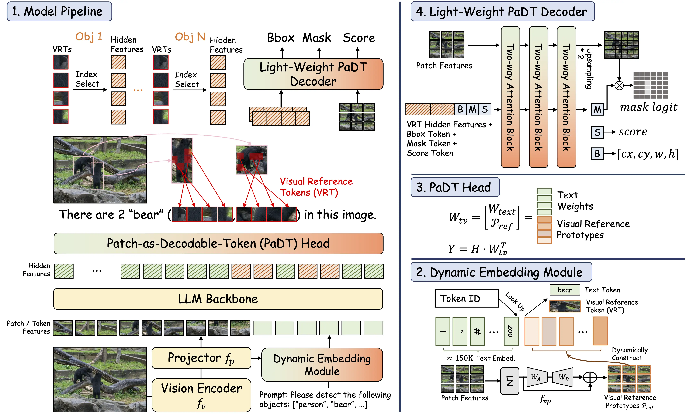
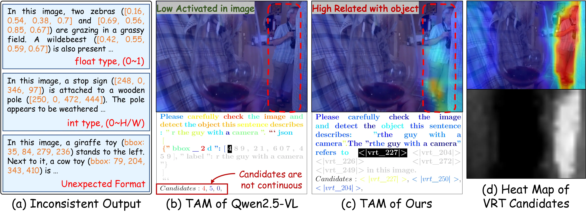
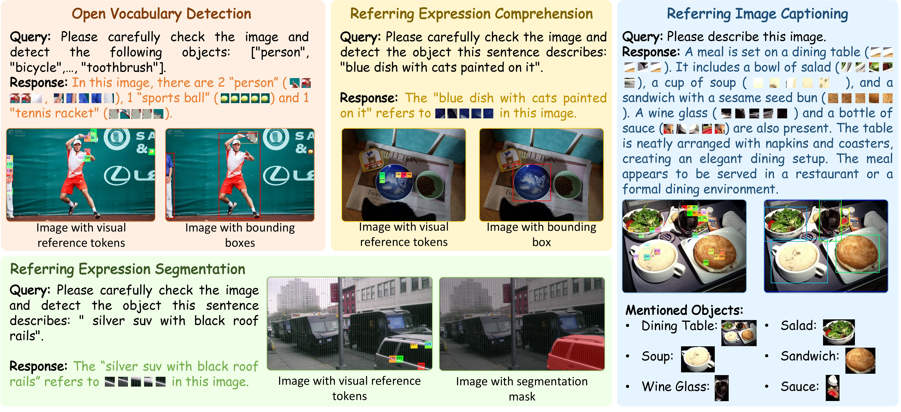
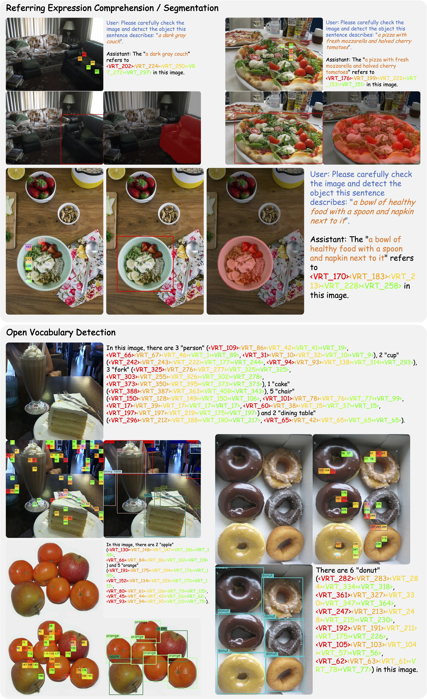
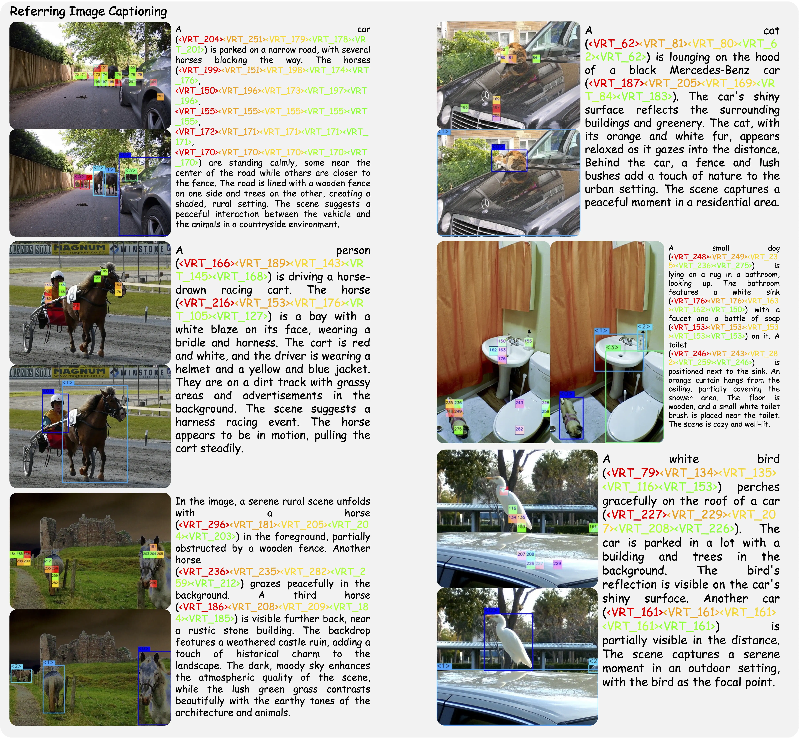
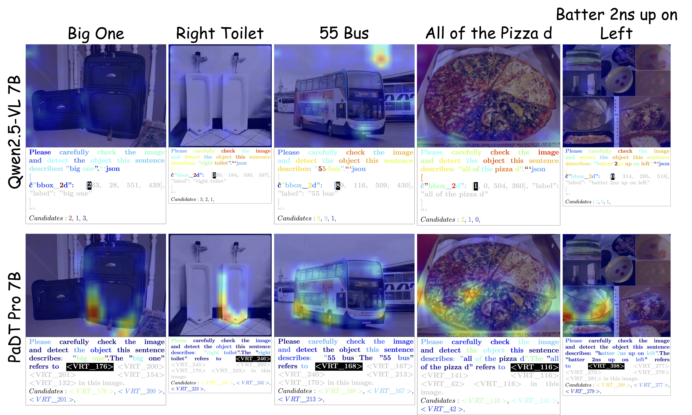

<div align='center'><h1>Patch-as-Decodable-Token: Towards Unified Multi-Modal Vision Tasks in MLLMs</h1></div>

<font size=4><div align='center'>[[🔗 Released Code](https://github.com/Gorilla-Lab-SCUT/PaDT)]
 [[🤗 Datasets](https://huggingface.co/collections/PaDT-MLLM/padt-dataset-68e400440ffb8c8f95e5ee20)] [[🤗 Checkpoints](https://huggingface.co/collections/PaDT-MLLM/padt-68e3f5c22e8ecbd6d0d13d43)]</div></font>
 <font size=4><div align='center'>[[📄 Tech Report](https://arxiv.org/abs/2510.01954)]</div></font>

<div align="center">

<p>Figure A. PaDT pipeline.</p>
</div>

## 🌟 Introduction

We are pleased to introduce **Patch-as-Decodable Token (PaDT)**, a unified paradigm that enables multimodal large language models (MLLMs) to directly generate both textual and visual outputs.

At the core of PaDT are **Visual Reference Tokens (VRTs)**. Unlike conventional MLLMs that represent visual targets using text-based bounding box coordinates (which are often less semantic and poorly aligned with the actual objects, as shown in Figure B), PaDT allows MLLMs to represent visual targets directly through visual patches. These VRTs let the model reason about visual information within the output sequence in a more natural and direct way.

By introducing VRTs, we achieve **semantic reasoning and object-specific visual tokens prediction** within the MLLM’s autoregressive generation process. The predicted visual tokens are then decoded into **low-level outputs** such as localization or segmentation maps using a plug-and-play lightweight PaDT decoder.

As illustrated in Figure C, we have validated PaDT across four major visual perception and understanding tasks. In all cases, PaDT achieves **state-of-the-art** performance compared to conventional character-by-character coordinate-generation MLLMs.

### Why PaDT Succeeds?

The success of PaDT stems from its deep insight into the visual capability bottlenecks of MLLMs.

1. **Native Vision-Language Alignment**: Instead of “fitting” vision into text space, PaDT directly treats visual patches as decodable tokens, achieving seamless modality alignment.

2. **Dynamic Visual Binding**: A dynamic embedding mechanism tightly binds Visual Reference Tokens (VRTs) to each image, preventing cross-image confusion.

3. **Unified Token Space**: Enables the LLM to handle language and vision uniformly, simplifying training and improving consistency.

4. **Lightweight Decoder**: Decouples dense prediction from the LLM, preserving its semantic reasoning while adding precise spatial output capability.

5. **Strong Multi-Task Generalization**: The PaDT Pro model, jointly trained on REC/RES/OVD/RIC, can switch tasks via prompts and outperforms single-task models.

We hope this work will **inspire further exploration** in the community:

- What does true multimodal reasoning look like?

- And is a purely text-based output ever sufficient for visual reasoning?

<div align="center">

<p>Figure B. Some observations on conventional character-by-character coordinate-generation MLLMs and our PaDT.</p>
</div>


<div align="center">

<p>Figure C. PaDT works on four visual perception and understanding tasks.</p>
</div>

## Quick Start

Clone this repo, and set up the environment with a few commands.

```bash
git clone https://github.com/Gorilla-Lab-SCUT/PaDT.git

conda create -n PaDT python=3.11
conda activate PaDT

bash setup.sh
```

The following contains a code snippet illustrating how to use our PaDT. More details can refer to [eval/test_demo.py](eval/test_demo.py).

```python
import torch
from transformers import AutoProcessor
from qwen_vl_utils import process_vision_info
from PaDT import PaDTForConditionalGeneration, VisonTextProcessingClass, parseVRTintoCompletion


TEST_IMG_PATH="./eval/imgs/000000368335.jpg"
MODEL_PATH="PaDT-MLLM/PaDT_Pro_3B"

# load model
model = PaDTForConditionalGeneration.from_pretrained(MODEL_PATH, torch_dtype=torch.bfloat16, device_map={"": 0})
# load processor
processor = AutoProcessor.from_pretrained(
    MODEL_PATH
)
processor = VisonTextProcessingClass(processor, model.config.vision_config.spatial_merge_size)
processor.prepare(model.model.embed_tokens.weight.shape[0])

# question prompt
PROMPT = """Please carefully check the image and detect the object this sentence describes: "The car is on the left side of the horse"."""

# construct conversation
message = [
    {
        "role": "user",
        "content": [
            {
                "type": "image",
                "image": TEST_IMG_PATH
            }, {
                "type": "text",
                "text": PROMPT
            }
        ]
    }
]
text = processor.apply_chat_template(message, tokenize=False, add_generation_prompt=True)
image_inputs, video_inputs = process_vision_info(message)
prompt_inputs = processor(
    text=[text],
    images=image_inputs,
    padding=True,
    padding_side="left",
    return_tensors="pt",
    add_special_tokens=False
).to("cuda:0")

# generate
with torch.inference_mode():
    generate_returned_result = model.generate(**prompt_inputs, use_cache=True, max_new_tokens=1024, do_sample=False,
        output_hidden_states=True, return_dict_in_generate=True)
    prompt_length = prompt_inputs["input_ids"].size(1)
    completion_ids = generate_returned_result['sequences'][:, prompt_length:]

    # extract Visual Reference Tokens within the sequence
    completions, feats, labels, vrts, vrts_feats = parseVRTintoCompletion(processor, completion_ids, generate_returned_result['hidden_states'], torch.Tensor([False]))

    print("\ngenerate result:", completions[0])

    # decode low-level visual task results
    low_res_image_embeds = generate_returned_result.past_image_embeds
    high_res_image_embeds = generate_returned_result.past_high_res_image_embeds
    visual_pe = generate_returned_result.past_visual_pe
    decoded_list = model.vl_decode(feats, low_res_image_embeds, high_res_image_embeds, prompt_inputs['image_grid_thw'], visual_pe)

    print(f"\npred_bboxes: {decoded_list['pred_boxes']},\npred_scores: {decoded_list['pred_score'].sigmoid()}\n")
```

## Models

- PaDT_OVD: Trained on COCO2017 training set.
- PaDT_REC: Trained on RefCOCO/+/g training set.
- PaDT_RIC: Trained on Referring Image Captioning training set.
- PaDT_Pro: Trained on the combined set of COCO2017, RefCOCO/+/g and Referring Image Captioning training sets.

| Model | Base VLM | Checkpoint | Task Type |
| - | - | - | - |
| PaDT_OVD_3B | Qwen2.5VL-3B | [PaDT-MLLM/PaDT_OVD_3B](https://huggingface.co/PaDT-MLLM/PaDT_OVD_3B) | Open Vocabulary Detection |
| PaDT_REC_3B | Qwen2.5VL-3B | [PaDT-MLLM/PaDT_REC_3B](https://huggingface.co/PaDT-MLLM/PaDT_REC_3B) | Referring Expression Comprehension/Segmentation | 
| PaDT_RIC_3B | Qwen2.5VL-3B | [PaDT-MLLM/PaDT_RIC_3B](https://huggingface.co/PaDT-MLLM/PaDT_RIC_3B) | Referring Image Captioning | 
| PaDT_Pro_3B | Qwen2.5VL-3B | [PaDT-MLLM/PaDT_Pro_3B](https://huggingface.co/PaDT-MLLM/PaDT_Pro_3B) | ALL |
| PaDT_OVD_7B | Qwen2.5VL-7B | [PaDT-MLLM/PaDT_OVD_7B](https://huggingface.co/PaDT-MLLM/PaDT_OVD_7B) | Open Vocabulary Detection |
| PaDT_REC_7B | Qwen2.5VL-7B | [PaDT-MLLM/PaDT_REC_7B](https://huggingface.co/PaDT-MLLM/PaDT_REC_7B) | Referring Expression Comprehension/Segmentation | 
| PaDT_RIC_7B | Qwen2.5VL-7B | [PaDT-MLLM/PaDT_RIC_7B](https://huggingface.co/PaDT-MLLM/PaDT_RIC_7B) | Referring Image Captioning | 
| PaDT_Pro_7B | Qwen2.5VL-7B | [PaDT-MLLM/PaDT_Pro_7B](https://huggingface.co/PaDT-MLLM/PaDT_Pro_7B) | ALL |


## Showcase

Here are some randomly selected test examples showcasing PaDT’s excellent performance.

- Referring Expression Comprehension/Segmentation and Open Vocabulary Detection Tasks

<div align="center">

</div>

- Referring Image Captioning Task

<div align="center">

</div>

- Token Activation Map Comparison

<div align="center">

</div>


## Training Instruction

Download Datasets:

- [COCO](https://cocodataset.org/#home)

- RefCOCO/+/g
    ```bash
    wget https://web.archive.org/web/20220413011718/https://bvisionweb1.cs.unc.edu/licheng/referit/data/refcoco.zip
    wget https://web.archive.org/web/20220413011656/https://bvisionweb1.cs.unc.edu/licheng/referit/data/refcoco+.zip
    wget https://web.archive.org/web/20220413012904/https://bvisionweb1.cs.unc.edu/licheng/referit/data/refcocog.zip
    ```

Unpack these datasets and place them under the following directory:

```
PaDT/
 ├── dataset/
 │    ├── coco/
 │    │     ├── annotations/
 │    │     ├── train2014/
 │    │     ├── train2017/
 │    │     ├── val2014/
 │    │     └── val2017/
 │    └── RefCOCO/
 │          ├── refcoco/
 │          ├── refcoco+/
 │          └── refcocog/
```

Preprocess the datasets:
- 1. Preprocess via our scripts. (Please first update the dataset path configuration in the preprocessing scripts)
    ```bash
    cd src/preprocess
    python process_coco.py
    python process_refcoco.py
    ```
- 2. We also released the preprocessed datasets which are ready to use for training in huggingface.

    | Dataset | Dataset Path | Task Type |
    | - | - | -|
    | COCO | [PaDT-MLLM/COCO](https://huggingface.co/datasets/PaDT-MLLM/COCO) | Open Vocabulary Detection |
    | RefCOCO | [PaDT-MLLM/RefCOCO](https://huggingface.co/datasets/PaDT-MLLM/RefCOCO) | Referring Expression Comprehension/Segmentation |
    | RIC | [PaDT-MLLM/ReferringImageCaptioning](https://huggingface.co/datasets/PaDT-MLLM/ReferringImageCaptioning) | Referring Image Captioning |


The training scripts in `run_scripts` are ready to execute.

For example: Train the PaDT-Pro 3B model on a single node with 8×96 GB GPUs.

```bash
bash ./run_scripts/padt_pro_3b_sft.sh
```

## Evaluation

We provide a simple inference example in `eval/test_demo.py`. More evaluation scripts will be added soon.

## License Agreement

PaDT is licensed under Apache 2.0.

## Citation

We kindly encourage citation of our work if you find it useful.

```
@misc{su2025patchasdecodabletokenunifiedmultimodalvision,
      title={Patch-as-Decodable-Token: Towards Unified Multi-Modal Vision Tasks in MLLMs}, 
      author={Yongyi Su and Haojie Zhang and Shijie Li and Nanqing Liu and Jingyi Liao and Junyi Pan and Yuan Liu and Xiaofen Xing and Chong Sun and Chen Li and Nancy F. Chen and Shuicheng Yan and Xulei Yang and Xun Xu},
      year={2025},
      eprint={2510.01954},
      archivePrefix={arXiv},
      primaryClass={cs.CV},
      url={https://arxiv.org/abs/2510.01954}, 
}
```

